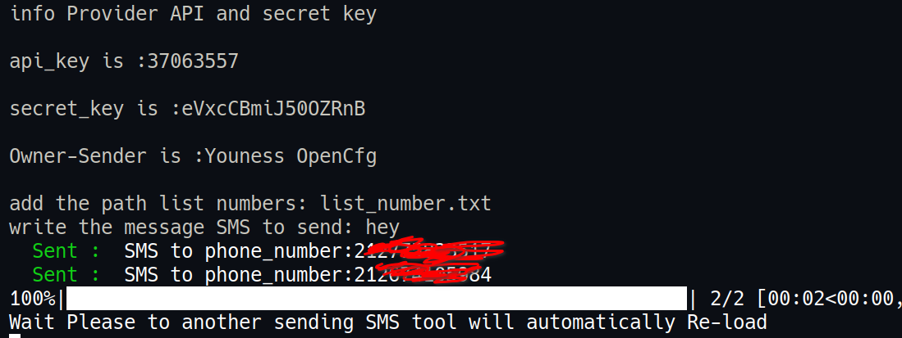
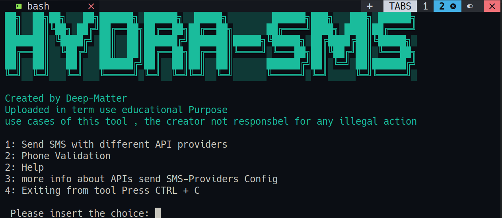

# SMS-python-Sender


### how to use **TOOL**
this tool created to show how to Send SMS using Different APIs Providers under Lecience MIT
the rules of are :
* ***Educational Purpose***
* ***not responsible for Illigal use case***
* ***Share how to building Automated Tool*** 
### Installation 
* **install**</br>
the tool in Local machine , this version only support Linux Distro RUN Following command:

```sh
  chmod a+x installer.sh && ./installer.sh --install 
```
* **run**</br>
to run the tool make sure you already installed all the Packages :
  
```sh 
  ./installer.sh --run
```
* **help**</br>
check other availebel option RUN :

```sh 
  ./installer.sh --help 
```
### information about **Haydra-SMS** :
* **APIs Credentials :**
The tool created to Send SMS and Verification numbers , to be able to use the tool you have to have at least one of this account to access the APIs Credentials Visit the Offcial websites :

  * [**Nexmo**](https://www.nexmo.com)
  * [**Twillo**](https://www.twillo.com)
  * [**textlocal**](https://www.textlocal.com)
  * [**Textbelt**](https://www.Textbelt.com)

after get the API Credentials you have to Put the Secrets in Configuration File called **APIs_Accounts_Credentials.cfg**

**Note** : Avoid using "" this when you put Credentials and make sure read Documentation AAPI
```YAML
  [Textlocal]
  api_key=  your-generated-key
  sender = Dofus
  [Nexmo]
  api_key =  your-generated-key
  secret_key =  your-secret-key
  sender = Your-Sener-Name
  [Twillo]
  account_sid= your-generated-key
  token_key = "your-token-key"
  Twillo_number = "your Twillo number"
  [textbelt]
  api_key = "your-generated-key"
```
* **How to USE Tool:**
when you run the tool will show options , **SMS-python-Sender** provide many Providers APIs Senders , choice one you have **Credential API**

1. **OPTIONS**
    - **(1)** : is allowing to choice one APIs to send 
    - **FILE LIST NUMBERS** : you need to setup **list_number.txt** and set all the phone numbers you want to send SMS and **MAKE SURE TO WRITE NUMBER WITH COUNTRY CODE**
    - **(2)** : Phone validation to ensure the SMS will deliver into existence phone . after chose this check **Output** Folder to use filtering phone **True**

2. **EORRO HANDLING**
this tool is take considration of EORRO HANDLING which means it handle the respond Status if **SENT** or **ERROR**
    - Screenshot ERROR HANDLING: 
        

3. **ScreenShot**
        


